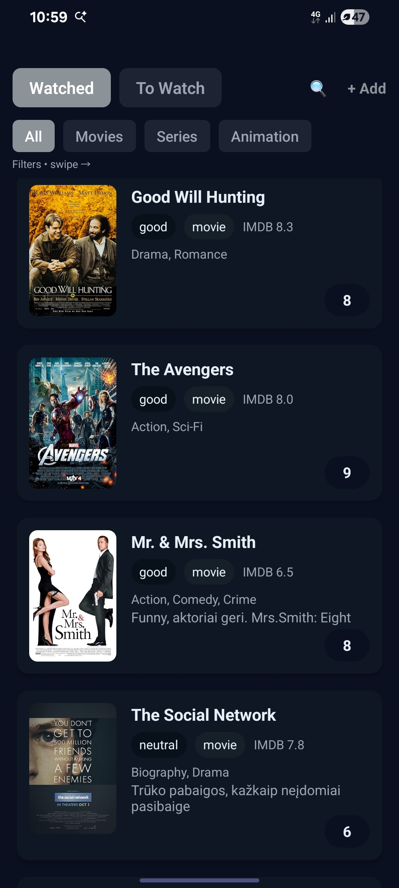
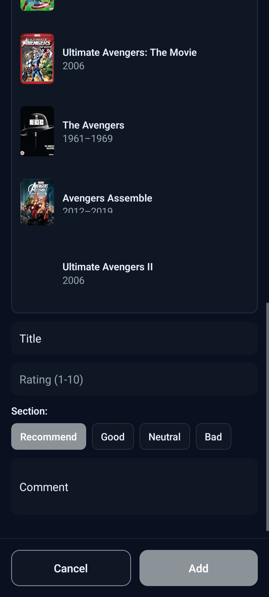
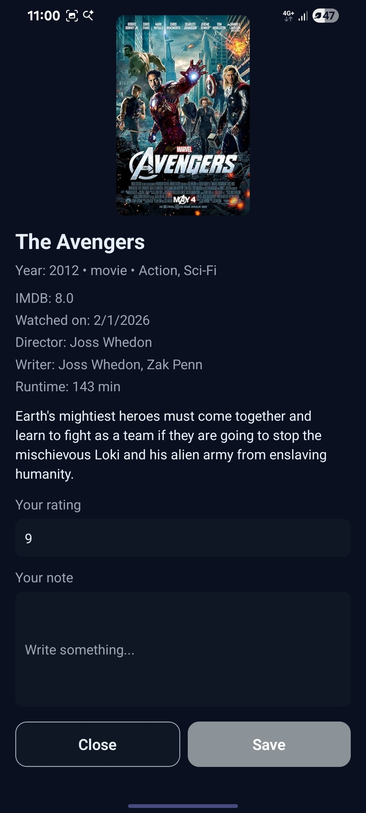

# Watchly

Watchly is a personal movie tracker built with Expo and React Native. It lets you save movies you have watched, keep a to-watch list, rate titles, write notes, search OMDb results, and export or import your library as JSON backups.

## Features

- Track movies in two lists: watched and to-watch.
- Rate titles from 1 to 10 and add short notes.
- Search OMDb while adding a movie and pull in poster, genre, runtime, and IMDb metadata.
- Filter and inspect your library from the built-in search screen.
- Export or restore your collection from JSON for simple backups.

## Setup

1. Install dependencies.

   ```bash
   npm install
   ```

2. Create your environment file.

   ```bash
   cp .env.example .env
   ```

3. Open `.env` and fill in the API values you want to use.

## Environment Variables

Create a `.env` file in the project root with the following keys:

```bash
OMDB_API_KEY=your_omdb_api_key_here
TRAKT_CLIENT_ID=optional_trakt_client_id
```

`OMDB_API_KEY` is required for in-app movie search. `TRAKT_CLIENT_ID` is optional and only needed if you plan to expand Trakt integrations later.

## Run It

Start the app with Expo:

```bash
npm run start
```

If you need Expo to work through a tunnel, use:

```bash
npx expo start --tunnel
```

From there you can open it in one of the Expo targets:

- Expo Go on a physical device
- Android emulator or device
- iOS simulator on macOS
- Web preview with `npm run web`

If tunnel startup fails with an `adb reverse` error, disconnect the attached Android device or enable USB debugging and try again. The tunnel itself still works for Expo Go, but Expo may refuse to reverse ports while a blocked device is connected.

If you want to build native dev clients locally, use:

```bash
npm run android
npm run ios
```

## Screenshots

Drop finished screenshots into a folder like `docs/screenshots/` and replace the placeholders below when you are ready to show the app off.

| Home | Add movie | Details |
| --- | --- | --- |
|  |  |  |

## Tech Stack

- Expo Router
- React Native
- OMDb API for movie metadata
- AsyncStorage for local persistence

## Notes

- The project uses file-based routing in the `app` directory.
- `app-example` is kept as the starter reset target from Expo.
